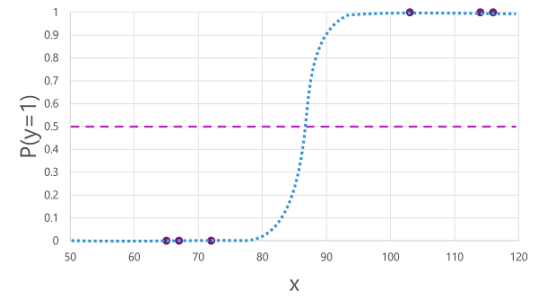

# Machine Learning

Machine learning is the basis for most modern artificial intelligence solutions. A familiarity with the core concepts on which machine learning is based is an important foundation for understanding AI.

Learning objectives
After completing this module, you will be able to:

Describe core concepts of machine learning
Identify different types of machine learning
Describe considerations for training and evaluating machine learning models
Describe core concepts of deep learning

>1 minute

## Introduction
Machine learning is in many ways the intersection of two disciplines - data science and software engineering. The goal of machine learning is to use data to create a predictive model that can be incorporated into a software application or service. To achieve this goal requires collaboration between data scientists who explore and prepare the data before using it to train a machine learning model, and software developers who integrate the models into applications where they're used to predict new data values (a process known as inferencing).

Machine learning has its origins in statistics and mathematical modeling of data. The fundamental idea of machine learning is to use data from past observations to predict unknown outcomes or values. For example:

The proprietor of an ice cream store might use an app that combines historical sales and weather records to predict how many ice creams they're likely to sell on a given day, based on the weather forecast.
A doctor might use clinical data from past patients to run automated tests that predict whether a new patient is at risk from diabetes based on factors like weight, blood glucose level, and other measurements.
A researcher in the Antarctic might use past observations to automate the identification of different penguin species (such as Adelie, Gentoo, or Chinstrap) based on measurements of a bird's flippers, bill, and other physical attributes.

> 5 minutes

## Machine learning models

Because machine learning is based on mathematics and statistics, it's common to think about machine learning models in mathematical terms. Fundamentally, a machine learning model is a software application that encapsulates a function to calculate an output value based on one or more input values. The process of defining that function is known as training. After the function has been defined, you can use it to predict new values in a process called inferencing.

Let's explore the steps involved in training and inferencing.
learn/images/machine-learning.png
The training data consists of past observations. In most cases, the observations include the observed attributes or features of the thing being observed, and the known value of the thing you want to train a model to predict (known as the label).

In mathematical terms, you'll often see the features referred to using the shorthand variable name x, and the label referred to as y. Usually, an observation consists of multiple feature values, so x is actually a vector (an array with multiple values), like this: [x1,x2,x3,...].

To make this clearer, let's consider the examples described previously:
learn/images/machinelearning.png
In the ice cream sales scenario, our goal is to train a model that can predict the number of ice cream sales based on the weather. The weather measurements for the day (temperature, rainfall, windspeed, and so on) would be the features (x), and the number of ice creams sold on each day would be the label (y).
In the medical scenario, the goal is to predict whether or not a patient is at risk of diabetes based on their clinical measurements. The patient's measurements (weight, blood glucose level, and so on) are the features (x), and the likelihood of diabetes (for example, 1 for at risk, 0 for not at risk) is the label (y).
In the Antarctic research scenario, we want to predict the species of a penguin based on its physical attributes. The key measurements of the penguin (length of its flippers, width of its bill, and so on) are the features (x), and the species (for example, 0 for Adelie, 1 for Gentoo, or 2 for Chinstrap) is the label (y).
An algorithm is applied to the data to try to determine a relationship between the features and the label, and generalize that relationship as a calculation that can be performed on x to calculate y. The specific algorithm used depends on the kind of predictive problem you're trying to solve (more about this later), but the basic principle is to try to fit the data to a function in which the values of the features can be used to calculate the label.

The result of the algorithm is a model that encapsulates the calculation derived by the algorithm as a function - let's call it f. In mathematical notation:

y = f(x)

Now that the training phase is complete, the trained model can be used for inferencing. The model is essentially a software program that encapsulates the function produced by the training process. You can input a set of feature values, and receive as an output a prediction of the corresponding label. Because the output from the model is a prediction that was calculated by the function, and not an observed value, you'll often see the output from the function shown as ŷ (which is rather delightfully verbalized as "y-hat").

## Types of machine learning model

There are multiple types of machine learning, and you must apply the appropriate type depending on what you're trying to predict. A breakdown of common types of machine learning is shown in the following diagram.
learn/images/machinelearning-types.png

>10 minutes

## Supervised machine learning
Supervised machine learning is a general term for machine learning algorithms in which the training data includes both feature values and known label values. Supervised machine learning is used to train models by determining a relationship between the features and labels in past observations, so that unknown labels can be predicted for features in future cases.

### Regression
Regression is a form of supervised machine learning in which the label predicted by the model is a numeric value. For example:

The number of ice creams sold on a given day, based on the temperature, rainfall, and windspeed.
The selling price of a property based on its size in square feet, the number of bedrooms it contains, and socio-economic metrics for its location.
The fuel efficiency (in miles-per-gallon) of a car based on its engine size, weight, width, height, and length.

### Classification
Classification is a form of supervised machine learning in which the label represents a categorization, or class. There are two common classification scenarios.
#### Binary classification
In binary classification, the label determines whether the observed item is (or isn't) an instance of a specific class. Or put another way, binary classification models predict one of two mutually exclusive outcomes. For example:

Whether a patient is at risk for diabetes based on clinical metrics like weight, age, blood glucose level, and so on.
Whether a bank customer will default on a loan based on income, credit history, age, and other factors.
Whether a mailing list customer will respond positively to a marketing offer based on demographic attributes and past purchases.
In all of these examples, the model predicts a binary true/false or positive/negative prediction for a single possible class.

#### Multiclass classification
Multiclass classification extends binary classification to predict a label that represents one of multiple possible classes. For example,

The species of a penguin (Adelie, Gentoo, or Chinstrap) based on its physical measurements.
The genre of a movie (comedy, horror, romance, adventure, or science fiction) based on its cast, director, and budget.
In most scenarios that involve a known set of multiple classes, multiclass classification is used to predict mutually exclusive labels. For example, a penguin can't be both a Gentoo and an Adelie. However, there are also some algorithms that you can use to train multilabel classification models, in which there may be more than one valid label for a single observation. For example, a movie could potentially be categorized as both science fiction and comedy.

### Unsupervised machine learning
Unsupervised machine learning involves training models using data that consists only of feature values without any known labels. Unsupervised machine learning algorithms determine relationships between the features of the observations in the training data.

#### Clustering
The most common form of unsupervised machine learning is clustering. A clustering algorithm identifies similarities between observations based on their features, and groups them into discrete clusters. For example:

Group similar flowers based on their size, number of leaves, and number of petals.
Identify groups of similar customers based on demographic attributes and purchasing behavior.
In some ways, clustering is similar to multiclass classification; in that it categorizes observations into discrete groups. The difference is that when using classification, you already know the classes to which the observations in the training data belong; so the algorithm works by determining the relationship between the features and the known classification label. In clustering, there's no previously known cluster label and the algorithm groups the data observations based purely on similarity of features.

In some cases, clustering is used to determine the set of classes that exist before training a classification model. For example, you might use clustering to segment your customers into groups, and then analyze those groups to identify and categorize different classes of customer (high value - low volume, frequent small purchaser, and so on). You could then use your categorizations to label the observations in your clustering results and use the labeled data to train a classification model that predicts to which customer category a new customer might belong.

## Regression
Regression models are trained to predict numeric label values based on training data that includes both features and known labels. The process for training a regression model (or indeed, any supervised machine learning model) involves multiple iterations in which you use an appropriate algorithm (usually with some parameterized settings) to train a model, evaluate the model's predictive performance, and refine the model by repeating the training process with different algorithms and parameters until you achieve an acceptable level of predictive accuracy.
learn/images/regression-algorithm.png

The diagram shows four key elements of the training process for supervised machine learning models:

Split the training data (randomly) to create a dataset with which to train the model while holding back a subset of the data that you'll use to validate the trained model.
Use an algorithm to fit the training data to a model. In the case of a regression model, use a regression algorithm such as linear regression.
Use the validation data you held back to test the model by predicting labels for the features.
Compare the known actual labels in the validation dataset to the labels that the model predicted. Then aggregate the differences between the predicted and actual label values to calculate a metric that indicates how accurately the model predicted for the validation data.
After each train, validate, and evaluate iteration, you can repeat the process with different algorithms and parameters until an acceptable evaluation metric is achieved.

#### Example - regression
Let's explore regression with a simplified example in which we'll train a model to predict a numeric label (y) based on a single feature value (x). Most real scenarios involve multiple feature values, which adds some complexity; but the principle is the same.

For our example, let's stick with the ice cream sales scenario we discussed previously. For our feature, we'll consider the temperature (let's assume the value is the maximum temperature on a given day), and the label we want to train a model to predict is the number of ice creams sold that day. We'll start with some historic data that includes records of daily temperatures (x) and ice cream sales (y):

Diagram of a thermometer.	Diagram of a ice creams.
Temperature (x)	Ice cream sales (y)
51	1
52	0
67	14
65	14
70	23
69	20
72	23
75	26
73	22
81	30
78	26
83	36

#### Training a regression model
We'll start by splitting the data and using a subset of it to train a model. Here's the training dataset:

Temperature (x)	Ice cream sales (y)
51	1
65	14
69	20
72	23
75	26
81	30
To get an insight of how these x and y values might relate to one another, we can plot them as coordinates along two axes, like this:

learn/images/regression-points.png

Now we're ready to apply an algorithm to our training data and fit it to a function that applies an operation to x to calculate y. One such algorithm is linear regression, which works by deriving a function that produces a straight line through the intersections of the x and y values while minimizing the average distance between the line and the plotted points, like this:

learn/images/regression-line.png

The line is a visual representation of the function in which the slope of the line describes how to calculate the value of y for a given value of x. The line intercepts the x axis at 50, so when x is 50, y is 0. As you can see from the axis markers in the plot, the line slopes so that every increase of 5 along the x axis results in an increase of 5 up the y axis; so when x is 55, y is 5; when x is 60, y is 10, and so on. To calculate a value of y for a given value of x, the function simply subtracts 50; in other words, the function can be expressed like this:

f(x) = x-50

You can use this function to predict the number of ice creams sold on a day with any given temperature. For example, suppose the weather forecast tells us that tomorrow it will be 77 degrees. We can apply our model to calculate 77-50 and predict that we'll sell 27 ice creams tomorrow.

#### Evaluating a regression model
To validate the model and evaluate how well it predicts, we held back some data for which we know the label (y) value. Here's the data we held back:

Temperature (x)	Ice cream sales (y)
52	0
67	14
70	23
73	22
78	26
83	36
We can use the model to predict the label for each of the observations in this dataset based on the feature (x) value; and then compare the predicted label (ŷ) to the known actual label value (y).

Using the model we trained earlier, which encapsulates the function f(x) = x-50, results in the following predictions:

Temperature (x)	Actual sales (y)	Predicted sales (ŷ)
52	0	2
67	14	17
70	23	20
73	22	23
78	26	28
83	36	33
We can plot both the predicted and actual labels against the feature values like this:
learn/images/regression-evaluation.png
The predicted labels are calculated by the model so they're on the function line, but there's some variance between the ŷ values calculated by the function and the actual y values from the validation dataset; which is indicated on the plot as a line between the ŷ and y values that shows how far off the prediction was from the actual value.

## Binary Classification

Classification, like regression, is a supervised machine learning technique; and therefore follows the same iterative process of training, validating, and evaluating models. Instead of calculating numeric values like a regression model, the algorithms used to train classification models calculate probability values for class assignment and the evaluation metrics used to assess model performance compare the predicted classes to the actual classes.

Binary classification algorithms are used to train a model that predicts one of two possible labels for a single class. Essentially, predicting true or false. In most real scenarios, the data observations used to train and validate the model consist of multiple feature (x) values and a y value that is either 1 or 0.

### Example - binary classification
To understand how binary classification works, let's look at a simplified example that uses a single feature (x) to predict whether the label y is 1 or 0. In this example, we'll use the blood glucose level of a patient to predict whether or not the patient has diabetes. Here's the data with which we'll train the model:

Blood glucose (x)	Diabetic? (y)
67	0
103	1
114	1
72	0
116	1
65	0

### Training a binary classification model
o train the model, we'll use an algorithm to fit the training data to a function that calculates the probability of the class label being true (in other words, that the patient has diabetes). Probability is measured as a value between 0.0 and 1.0, such that the total probability for all possible classes is 1.0. So for example, if the probability of a patient having diabetes is 0.7, then there's a corresponding probability of 0.3 that the patient isn't diabetic.

There are many algorithms that can be used for binary classification, such as logistic regression, which derives a sigmoid (S-shaped) function with values between 0.0 and 1.0, like this:

The function produced by the algorithm describes the probability of y being true (y=1) for a given value of x. Mathematically, you can express the function like this:

f(x) = P(y=1 | x)

For three of the six observations in the training data, we know that y is definitely true, so the probability for those observations that y=1 is 1.0 and for the other three, we know that y is definitely false, so the probability that y=1 is 0.0. The S-shaped curve describes the probability distribution so that plotting a value of x on the line identifies the corresponding probability that y is 1.
