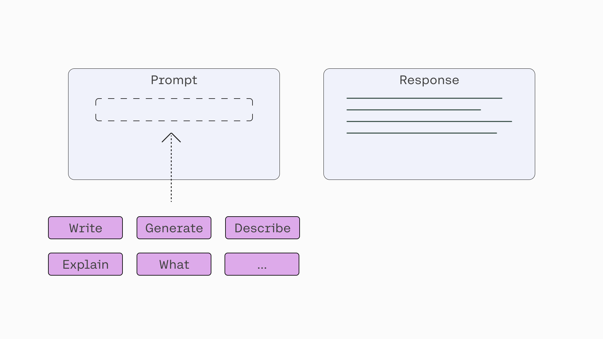

When working with large language models (LLMs), the prompt is the key to getting the desired response. A well-designed prompt will result in useful and accurate responses from a model and will considerably improve your experience interacting with it.

Prompts can be as simple as a one-liner, or they can be as complex as multiple layers of specific information. The more specific your command is, the more likely you will get exactly what you need from the model. We’ll look at some tips and ideas for constructing the commands in your prompt to help you get to your intended outcome. We’ll focus on the broad patterns without going into the long-tail list of techniques and tricks.

### Setup
Let’s also define a function to take a prompt and a temperature value and then call the Chat endpoint, which is how we can access the Command model.​​ Here, we select the model type to be command.

We set a default temperature value of 0, which nudges the response to be more predictable and less random. Throughout this article, you’ll see different temperature values being used in different situations. Increasing the temperature value tells the model to generate less predictable responses and instead be more “creative.”

### Instruction
While prompts can morph into something very lengthy and complex, it doesn’t have to be that way all the time. At its core, prompting a Command model is about sending an instruction to a text generation model and getting a response back. Hence, the smallest unit of a perfectly complete prompt is a short line of instruction to the model.

Let’s say we want to generate a product description for a wireless headphone. Here’s an example prompt, where we create a variable for the user to input some text and merge that into the main prompt.

The model returns the following sample response, which does the job we asked for.

### Specifics
A simple and short prompt can get you started, but in most cases, you’ll need to add specificity to your instructions. A generic prompt will return a generic response, and in most cases, that’s not what we want. In the same way that specific instructions will help humans do our job well, a model needs to be supplied with specific details to guide its response.

Going 
back to the previous prompt, the generated product description was great, but what if we wanted it to include specific things, such as its features, who it is designed for, and so on? We can adjust the prompt to take more inputs from the user, like so:

In the example above, we pack the additional details of the prompt in a single paragraph. Alternatively, we can also compose it to be more structured, like so:

And here’s an example response. This time, the product description is tailored more specifically to our desired target customer, includes the key features that we specified, and sprinkles benefit statements throughout — all coming from the instruction we added to the prompt.

`There are many other angles to add specificity to a prompt. Here are some examples:

Style: Telling the model to provide a response that follows a certain style or framework. For example, instead of asking the model to “Generate an ad copy for a wireless headphone product” in the generic sense, we ask it to follow a certain style, such as “Generate an ad copy for a wireless headphone product, following the AIDA Framework – Attention, Interest, Desire, Action.”
Tone: Adding a line mentioning how the tone of a piece of text should be, such as professional, inspirational, fun, serious, and so on. For example, “Tone: casual”
Persona: Telling the model to act like a certain persona helps to add originality and quality to the response. For example, “You are a world-class content marketer. Write a product description for…”
Length: Telling the model to generate text with a specific length, be it in words, paragraphs, and others. This helps guide the model to be verbose, concise, or somewhere in between. For example, “Write in three paragraphs the benefits of …”`

### Context
While LLMs excel in text generation tasks, they struggle in context-aware scenarios. Here’s an example. If you were to ask the model for the top qualities to look for in wireless headphones, it will duly generate a solid list of points. But if you were to ask it for the top qualities of the CO-1T headphone, it will not be able to provide an accurate response because it doesn’t know about it (CO-1T is a hypothetical product we just made up for illustration purposes).

In real applications, being able to add context to a prompt is key because this is what enables personalized generative AI for a team or company. It makes many use cases possible, such as intelligent assistants, customer support, and productivity tools, that retrieve the right information from a wide range of sources and add it to the prompt.

This is a whole topic on its own, but to provide some idea, this demo shows an example of information retrieval in action. In this article though, we’ll assume that the right information is already retrieved and added to the prompt.

Here’s an example where we ask the model to list the features of the CO-1T wireless headphone without any additional context:

This generates a response that the model makes up since it doesn’t have any information to refer to.

> And here’s the same request to the model, this time with the product description of the product added as context.

### Format
So far, we saw how to get the model to generate responses that follow certain styles or include specific information. But we can also get the model to generate responses in a certain format. Let’s look at a couple of them: markdown tables and JSON strings.

Here, the task is to extract information from a list of invoices. Instead of providing the information in plain text, we can prompt the model to generate a table that contains all the information required.

